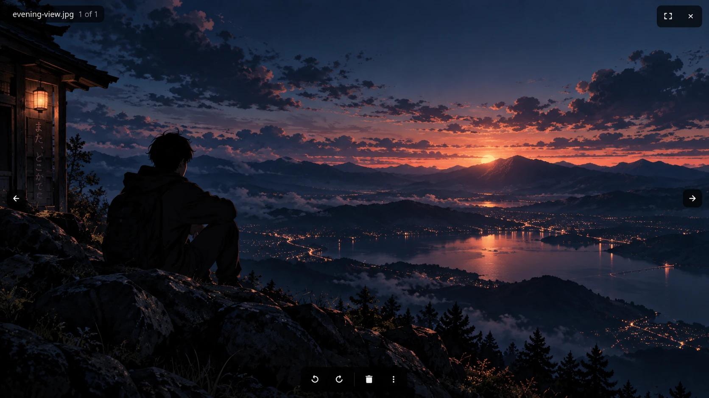

# open-mpv

open-mpv is a fast, minimal photo and video viewer for GNOME on Wayland. It
opens local media without building a media library, using the network or
filling the window with controls.

> **Current support:** Fedora 44 Workstation, GNOME, Wayland and x86-64. Other
> Linux distributions and desktop environments are not supported yet.



## Install on Fedora 44

Install the latest release with DNF:

```sh
sudo dnf install https://github.com/TheRealShek/open-mpv/releases/latest/download/open-mpv-fedora44-x86_64.rpm
```

GitHub Releases are not a DNF repository, so run the same command again when a
new release is available. To remove open-mpv:

```sh
sudo dnf remove open-mpv
```

Installation does not change your default applications. To make open-mpv the
default for a file type, right-click that type in Files, choose **Open With**,
then select open-mpv.

## Open media

Open a photo, video or folder from Files, drag a file into the window, or pass
a path on the command line:

```sh
open-mpv ~/Pictures/photo.jpg
open-mpv ~/Videos/video.mp4
open-mpv ~/Pictures
```

You can also start open-mpv without a path and choose **Open File** or
**Open Folder**.

## What it does

- Opens photos, animated images, SVG files and local videos in one window.
- Moves through the supported media files in the current folder.
- Supports zoom, pan, fit, rotation and fullscreen.
- Plays video with seeking, volume, speed, audio-track and subtitle controls.
- Moves files to trash and offers a short Undo action.
- Saves supported image rotations atomically. JPEG rotation is lossless, and
  normal file ownership, permissions and user metadata are preserved.
- Draws a box or arrow on a still image and copies the result without changing
  the original.
- Supports optional mpv-style configuration and custom key bindings.

open-mpv has no media library, telemetry, network access or persistent
background service. Images are decoded by glycin in a separate sandboxed
process. The app changes your files only when you explicitly trash, restore or
save a rotation; Quick Markup writes only to the clipboard.

## Supported media

Images include JPEG, PNG, WebP, AVIF, HEIF/HEIC, JPEG XL, TIFF, SVG, GIF and
other formats supported by the installed glycin loaders. Animated GIF, WebP
and PNG files play automatically.

Videos include MP4, MKV, WebM, MOV and AVI. Playback uses the codecs installed
for GStreamer and prefers compatible hardware decoding. The optional
`gstreamer1-plugin-libav` package provides a software fallback for more video
formats.

## Essential controls

Press `?` inside the app for the complete shortcut guide.

| Key or gesture | Action |
| --- | --- |
| `Ctrl+O` / `Ctrl+Shift+O` | Open a file / folder |
| `Right` / `Left` | Next / previous file; pan when zoomed |
| Scroll / pinch | Zoom at the pointer |
| `0` / `1` / `Z` | Fit / actual size / toggle between them |
| `R` / `Shift+R` | Rotate right / left |
| `S` | Save the current rotation when supported |
| `Delete` / `Ctrl+Z` | Move to trash / undo markup or the offered trash action |
| `Space` | Pause or resume video; advance from a still image |
| `J` / `L` | Seek video back / forward 10 seconds |
| `A` | Start or cancel Quick Markup |
| `F` / `F11` / double-click | Toggle fullscreen |
| `Escape` | Cancel the current mode, leave fullscreen or quit |

Move the pointer to show controls. Right-click the media or use the three-dot
button for less common actions.

## Configuration

Configuration is optional. See the [configuration guide](docs/CONFIGURATION.md)
for settings and custom key bindings.

## Troubleshooting

If images do not open, check that `glycin-loaders` is installed. Video support
depends on the installed GStreamer plugins, graphics driver and codecs; the
optional `gstreamer1-plugin-libav` package supplies a software fallback.

open-mpv writes diagnostics to stderr. When it was opened from Files, view
them with:

```sh
journalctl -b _COMM=open-mpv
```

See the [troubleshooting guide](docs/TROUBLESHOOTING.md) for decoder checks,
logging options and the information to collect when playback fails.

## Contributing

See [CONTRIBUTING.md](CONTRIBUTING.md) to build the project and run its checks.

## License

open-mpv is available under the [MIT License](LICENSE).
